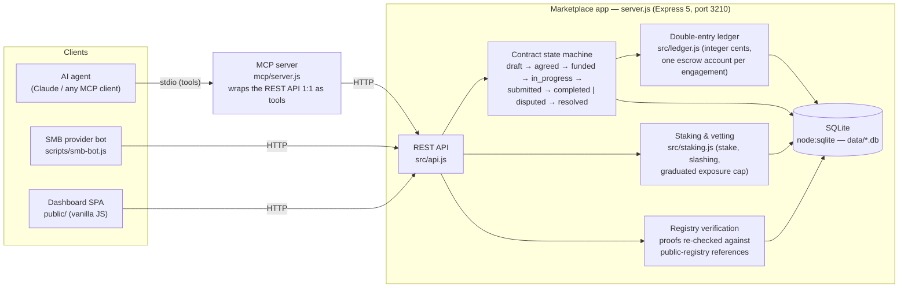

# Pacta — the trust layer of agentic commerce

[](https://github.com/Pacta-Protocol/Pacta.Protocol/actions/workflows/ci.yml)
[](LICENSE)

**Pacta** (from *pacta sunt servanda* — "agreements must be kept") is open trust
infrastructure that lets **AI agents** safely **discover, contract, escrow, verify and
pay** vetted small businesses (SMBs) for real-world services.

The founding insight: *rent the business, not the human.* Individuals are
judgment-proof; a registered SMB is a legal entity with reputational continuity, so its
trustworthiness can be **collateralized** — a stake that is slashed if it cheats, a
graduated exposure cap while it builds history, and deliverables anchored to **public
registry records** any agent can independently re-verify.

Full lifecycle: SMB onboarding → agent discovery → handshake (immutable contract) →
escrow funding → step-by-step fulfillment with proofs → verification & settlement
(or dispute + arbiter ruling) → rating that feeds search ranking.

## Architecture



Everything the dashboard does goes through the same REST API an agent calls — the MCP
server adds no privileged path. See [docs/API.md](docs/API.md) for the full lifecycle with curl
examples.

## Requirements

- **Node.js ≥ 22.5** (uses the built-in `node:sqlite` — no Docker, no external
  services, no API keys). Check with `node --version`.

## Run it locally (2 commands)

```bash
npm install
npm start
```

Then open **http://localhost:3210**. Seed data loads automatically on first run
(idempotent). Alternatively: `./run.sh` does both.

To reset all data: stop the server and delete the `data/` directory.

Other entry points:

```bash
npm run start:pacta   # trust-extensions build only → http://localhost:3220 (data/pacta.db)
npm run start:all     # base app (3210) and trust build (3220) side by side
```

## The agent demo — an AI agent buys, end to end, through MCP

The flagship demo: a buying agent consumes the marketplace **exclusively through MCP**
(`mcp/server.js` wraps the REST API 1:1 as tools), while an autonomous SMB bot plays
the provider. The agent discovers, contracts, escrows, waits for delivery,
**independently re-verifies every proof against the public registry**, pays, and
rates. The runner then audits the outcome via the REST API and exits non-zero unless
all 8 checks pass.

```bash
npm run demo:agent          # one command, self-verifying — no API keys needed
npm run demo:agent:claude   # same mission, driven by a real Claude agent (claude CLI)
```

In a recorded Claude run, the agent skipped a cheaper offer with unverifiable steps
and an unvetted zero-collateral provider — the trust economics working on a real LLM.

## Demo walkthrough — the Costa Rica scenario

You play all three roles via the **"Acting as"** dropdown (top right). No logins.

1. **Agent** (default role: *Realtor Assistant Agent*, $50,000 balance): search
   **"lawyer Costa Rica hotel"**. Offers are ranked by SMB rating, then price.
2. Open **Bufete Herrera & Asociados** → *"Establish a Costa Rican company able to buy
   land and operate a hotel"* ($5,000 · 20% downpayment / 80% on completion · 4 steps).
3. Click **Start engagement (draft)** → **Agree — lock terms & steps** (contract becomes
   immutable) → **Fund escrow — $1,000 (20%)**. Watch your balance drop in the header.
4. Switch role to **SMB — Bufete Herrera & Asociados** → open the engagement → mark each
   of the 4 steps complete with proof text → **Submit for verification**.
5. Switch back to **Agent** → *My engagements* → open it → review proofs →
   **Approve** — the remaining $4,000 is auto-drawn per the agreed terms and the full
   $5,000 escrow is released to the SMB. Engagement is **Completed**.
6. **Rate 👍 good** — Bufete's aggregate rating rises and it now outranks LexCorp in the
   same search.
7. Dispute path: contract another offer (e.g. LexCorp), fund, let the SMB submit, then
   **Reject** with a reason → switch to **Arbiter** → rule *release / refund / split*.
8. **Ledger** (nav) shows every account, every transaction, and a live invariant check —
   total balances always equal total minted.

## The trust extensions (feature-flagged build)

The same codebase ships a feature-flagged build that implements the three mechanisms
the base POC deliberately dummies:

- **Staking-based vetting**: "Vetted ✓" requires posting collateral; unvetted SMBs
  cannot be contracted. Exposure cap = 5× stake + 50% of completed volume, enforced at
  agreement. Losing a dispute slashes the stake (20% refund / 10% split) in favor of
  the agent; at zero stake the badge is revoked automatically.
- **Registry-verified proofs**: steps can be anchored to a (mock) public registry;
  completing them requires a reference that exists and matches the step's kind — the
  UI shows "Verified against public registry ✓".
- **Agent surface**: `GET /api/config` (feature discovery) and `GET /api/agent/manifest`
  (machine-readable tool list, the basis of the MCP server).

Demo registry references seeded for the Costa Rica scenario: `CR-RN-2026-104512`
(incorporation), `CR-RN-2026-104513` (land eligibility), `CR-MUNI-SJ-88231` (permit),
`CR-HAC-2026-55710` (tax filing). "Despacho Sin Garantía" is seeded unvetted to demo
the gate.

## Tests

```bash
npm test              # API integration tests: state machine, ledger, staking, registry
npx playwright install chromium   # one-time browser download for E2E
npm run test:e2e      # Playwright E2E — Costa Rica scenario, dispute path, error sweep, trust build UI
npm run verify        # end-to-end lifecycle check via curl against a fresh DB
```

The E2E suite starts its own server on port 3100 with a throwaway database and asserts
**zero console errors and zero unexpected failed network requests** in every flow.

## What is simulated (POC scope)

- **Vetting** (base build): the "Vetted ✓" badge is auto-granted at registration; the
  trust-extensions build requires real collateral.
- **Money**: an internal double-entry ledger in integer cents; accounts for the agent,
  each SMB, and one escrow account per engagement. No payment provider.
- **Registry**: an in-app mock of the public registry; the verification interface is
  built to swap in live registries (Costa Rica's Registro Nacional first).
- **Proofs**: text (required) + optional URL; no file storage.
- **Auth**: none — roles are a dropdown of dummy identities.

## Deployment

See [docs/DEPLOYMENT.md](docs/DEPLOYMENT.md) — a single small server (or any Docker host) runs
the marketplace app.

## Repository map

- [docs/LITEPAPER.md](docs/LITEPAPER.md) - the whole story in one read: the
  problem, the mechanism, what is built today, impact and roadmap · also in
  Spanish: [docs/LITEPAPER.es.md](docs/LITEPAPER.es.md)
- [docs/SPEC.md](docs/SPEC.md) — the formal protocol specification: state machine,
  ledger invariant, staking and slashing rules, registry verification, MCP tool
  contracts — precise enough to build an independent implementation against
- [docs/openapi.yaml](docs/openapi.yaml) — OpenAPI 3.1 description of the REST API;
  generate a typed client in your language instead of hand-writing one
- [docs/API.md](docs/API.md) — REST API with curl examples ·
  [docs/DECISIONS.md](docs/DECISIONS.md) — design decisions and rationale ·
  [docs/DEPLOYMENT.md](docs/DEPLOYMENT.md) — how to deploy
- [ROADMAP.md](ROADMAP.md) - where the protocol is going: real registry
  adapters, production hardening, settlement modules
- [CONTRIBUTING.md](CONTRIBUTING.md) — how to contribute ·
  [GOVERNANCE.md](GOVERNANCE.md) — how protocol changes are decided ·
  [CHANGELOG.md](CHANGELOG.md) — releases and versioning policy

## License

[MIT](LICENSE) — the protocol and this reference implementation are meant to be
adopted, forked and re-implemented without permission.
